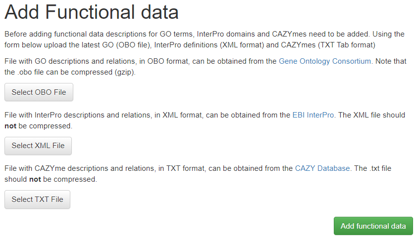

# Adding GO term, InterPro domain and CAZymes definition

Descriptions for GO terms, InterPro domains and CAZymes descriptions should be added before
adding functional annotation. This step should be completed first. In
the top menu click on 'Add' and select 'Functional Data'. 
 

The GO descriptions can be obtained from the Gene Ontology Consortium's 
official website in OBO format [here](http://geneontology.org/page/download-ontology).
InterPro domains and descriptions (called the **Entry list**) are found on EBI InterPro's download pages [here](https://www.ebi.ac.uk/interpro/download.html). CAZymes descriptions can be access on CAZY database that contains info about enzymes that degrade, modify, or create glycosidic bonds [here](http://www.cazy.org/).
**Decompress the .gz file prior to uploading.** 

Click the buttons on the page and select the corresponding files, next 
click 'Add functional data' to upload the files to your server and 
import them in the database. This process can take some time, do not 
close the browser window. 

**Note: The existing tables will be cleared before adding the new 
definitions. Do not update this information if GO/InterPro data is 
already added to species!**
