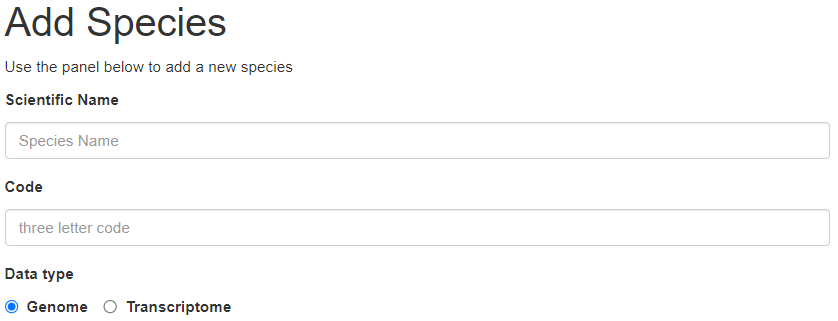
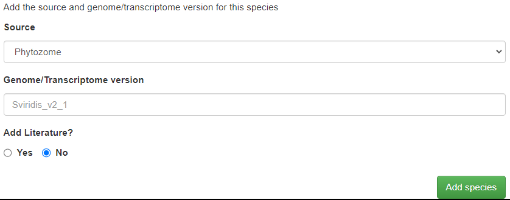
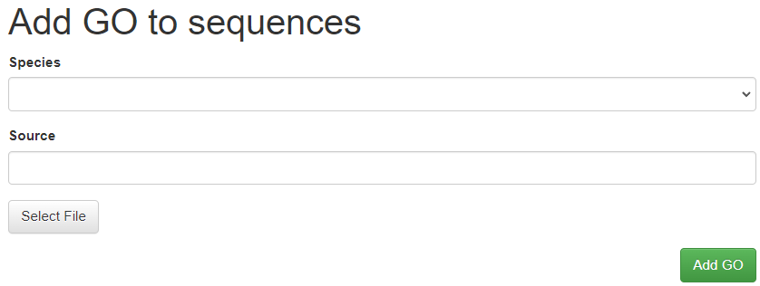
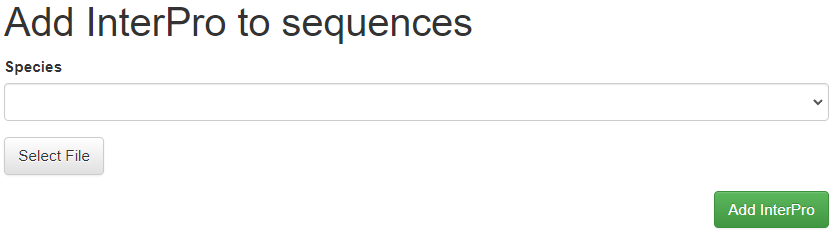
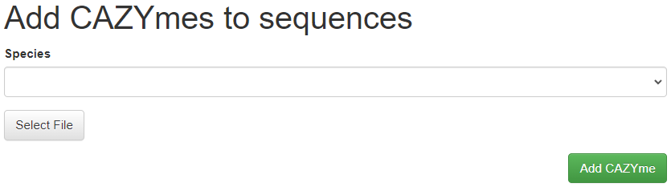
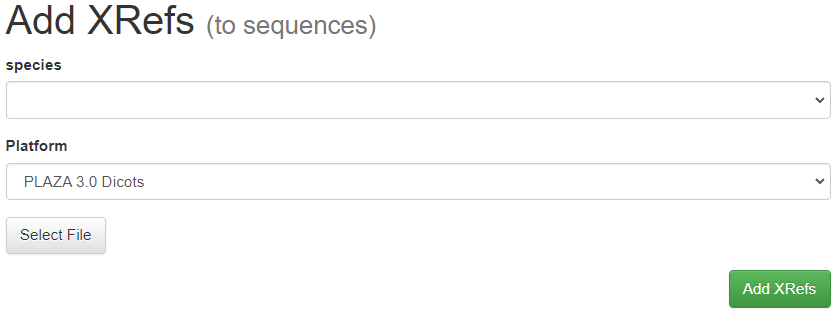
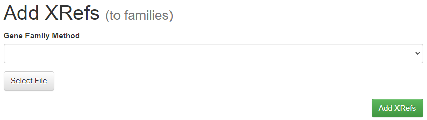

# Adding a new species and functional data

Adding a species requires multiple steps, follow the steps below for 
each species. 

## Adding the species and sequences

On the 'Admin panel', under 'Add' select 'Species'.
Fill in the full scientific name (or the name you wish to appear on the website) for
the species and select a 'three letter code', that is unique for the
species. And select a data type between 'Genome' and 'Transcriptome'.
*For the code we recommend a combination of genus and species cfr. **H**omo 
**sa**piens = hsa, note that while three characters is recommended it is
not required, longer codes are possible. 



Some visualizations require a color specific for each species, these can 
be entered using the controls below (clicking the box opens a color 
picker, there is no need to manually add in hex values).

Select a fasta file with all **coding sequences** or **RNAs**, in the fasta 
headers the gene name (and only the name) needs to be present. These are
the names genes will receive on the website.

```
>Gene1                      >Gene1
ATG...          OR          UTG...
>Gene2                      >Gene2
ATG...                      UTG...
```

Finally, add the source and the genome/trascriptome version for the specie.
To upload the data and add the species to the database click 'Add species'



## Adding descriptions to sequences

In the 'Admin panel', under 'Add' -> 'Sequence descriptions'.

Select the **species** and a tab-delimited file containing on a single line the gene ID and
description (example below). Click **Add descriptions** to upload the file and add the 
description to the database.

```
gene01    gene01 description
gene02    gene02 description
gene03    gene03 description
...
```

Note: This step can be very time consuming if Whooshee indexing is enabled in your config! When
setting up a database with multiple species, consider disabling indexing while building the DB and
later enabling it + rebuilding the index (found under controls in the admin panel).

## Adding functional Annotation to sequences

**GO** terms can be imported from tab delimited files, containing 3 
columns: gene name, GO label and the evidence tag.

```
Gene1   GO:0004621  IEA
Gene1   GO:0004622  IEA
Gene2   GO:0000227  ISS
...
```

In the 'Admin panel', under 'Add' -> 'GO Genes' such a file can be 
uploaded, for a species. Additionally a description needs to be provided
from where the GO terms in the file originate from (the source). 
 


**InterPro** domains can be imported directly from [InterProScan](http://www.ebi.ac.uk/interpro/download.html) output. 
To do so, in the 'Admin panel', under 'Add' -> 'InterPro Genes' select a species, select the file and click 'Add InterPro'.
InterProScan results must be in TSV format.



**CAZYme** descriptions can be access on CAZY database [here](http://www.cazy.org/).
To upload, in the 'Admin panel', under 'Add' -> 'CAZYme Genes' select a species, select the file and click 'Add CAZYme'.



## Adding external references and aliases/tokens

Some genes have an short handle that is easier to remember, this is also called the alias, 
gene symbol or token. CoNekT uses these short labels in network graphs when they are 
available. In addition to this, external references can be added to genes connecting your
release with existing platforms.

In the 'Admin panel', under 'Add' -> 'XRefs Genes' this can be done. Select the **species** 
first, and as platform select **custom**. Select a file containing the xrefs, here a 
tab-delimited file is required with four columns, the sequence identifier,  the name in the referenced platform, the name of the platform and the url. 
(empty in case no link exists).

```
gene01 gene01 external_website http://url.com/gene01
gene02 gene02 external_website http://url.com/gene02
gene03 gene03 external_website http://url.com/gene03
...
```


In the 'Admin panel', under 'Add' -> 'XRefs Families' we can adds an external link for a gene family. Could be useful if gene families are derived from a different platform, or to link to similar families in other databases.
Example input: four columns are required (tab delimited), the family name, the name in the referenced platform, the name of the platform and the url.

```
family01 family01 external_website http://url.com/family01
family02 family02 external_website http://url.com/family02
family03 family03 external_website http://url.com/family03
...
```
