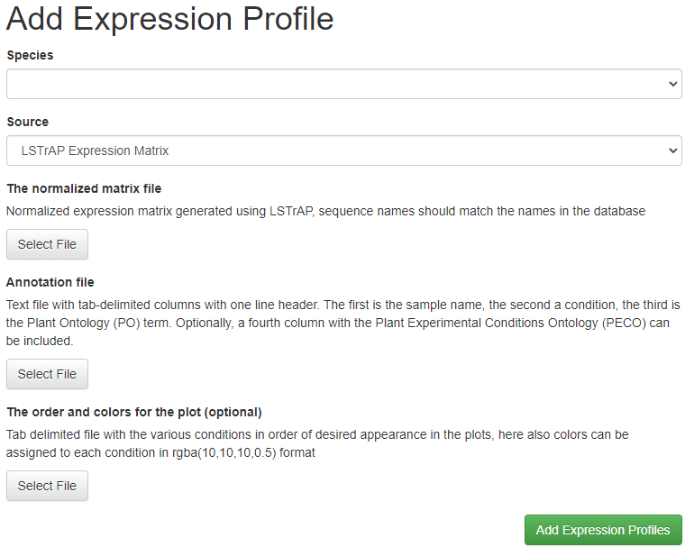
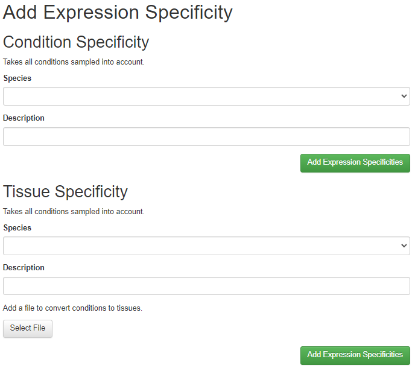

# Adding expression data

Expression data should be processed using [LSTrAP](https://github.molgen.mpg.de/proost/LSTrAP), 
this will generate the expression matrix, coexpression networks and 
clusters that can be directly imported into CoNekt. Note that in 
some cases additional files, containing meta information, need to be 
provided.
 
## Adding expression profiles

In the 'Admin panel', under 'Add' -> 'Expression profiles'. Select the
species and the source (currently only LSTrAP expression matrices are supported). 

Next, select the expression matrix (generated using LSTrAP). Using a 
normalized (TPM or RPKM) matrix is strongly recommended !

Furthermore two additional files need to be provided, one that links the
run identifiers to specific conditions. This tab delimited file should 
be structured as indicated below, a one-line header (which is ignored) 

Futhermore at least five columns are required.
The first is the sample ID (must be unique), as it occurs in the matrix
(omit the suffix '.htseq'), the second column indicates the condition sampled.
Third and fourth columns are the protocol of sequencing, the fifth and sixth columns
are the ID of Plant Ontology (PO) and Plant Experimental COndition Ontology (PECO) library, respective. 

```
SampleID     ConditionDescription     Strandness     Layout     PO     PECO
SRR068956    Endosperm    strand specific    paired-end    PO:0009089
SRR068957    Endosperm    strand specific    paired-end    PO:0009089
SRR068958    Endosperm    strand specific    paired-end    PO:0009089
SRR068959    Endosperm    strand specific    paired-end    PO:0009089
SRR068971    Endosperm    strand specific    paired-end    PO:0009089
SRR068975    Endosperm    strand specific    paired-end    PO:0009089
SRR068976    Endosperm    strand specific    paired-end    PO:0009089
SRR068977    Endosperm    strand specific    paired-end    PO:0009089
SRR068987    Endosperm    strand specific    paired-end    PO:0009089
...
```

Furthermore a file to color code tissues can be provided. Here for each condition a color
(that will be used in profile plots needs to be specified). Note that the order in this fill
will be the order in profile plots! Colors need to be in rgba(0-255,0-255,0-255,0-1) format.

```
Roots (apex), 7 DAG	rgba(153, 51, 0, 0.5)
Roots (differentation zone), 4 DAP	rgba(153, 51, 0, 0.5)
Roots (elongation zone), 4 DAP	rgba(153, 51, 0, 0.5)
Roots (meristematic zone), 4 DAP	rgba(153, 51, 0, 0.5)
Roots (QC cells), 6 DAS	rgba(153, 51, 0, 0.5)
Roots (stele cells), 7 DAS	rgba(153, 51, 0, 0.5)
Roots (tip)	rgba(153, 51, 0, 0.5)
Leaves (rosette), 21 DAG	rgba(0, 153, 51, 0.5)
Leaves (rosette), 29 DAG	rgba(0, 153, 51, 0.5)
...
```

If all files are selected click 'Add Expression Profiles' to upload the
data and add everything to the database.





## Calculating expression specificity and summerized profiles

To enable Specificity searches, SPM values need to be pre-calculated. From the admin menu 
select 'Add' -> 'Expression Specificty'.



Here you have two options available. The first one will calculate SPM values for all conditions
in the profiles. Here you simply need to **select the species**, **enter a description** and click 
**"Add Expression Specificities"**.

In case different conditions need to be grouped, the second option should be used. Here you 
**select the species** and **enter a description** similarly to the previous. Additionally a
tab-delimited text file is required grouping conditions into broader categories. 

```
Roots (apex), 7 DAG Roots   rgba(153, 51, 0, 0.5)
Roots (differentation zone), 4 DAP  Roots   rgba(153, 51, 0, 0.5)
Roots (elongation zone), 4 DAP  Roots   rgba(153, 51, 0, 0.5)
Roots (meristematic zone), 4 DAP    Roots   rgba(153, 51, 0, 0.5)
Roots (QC cells), 6 DAS Roots   rgba(153, 51, 0, 0.5)
...
```

Three columns are required, (i) the label in the full profile, (ii) the group it belongs to 
and (iii) the color for that group. After adding that file click **"Add Expression Specificities"**
in that section.

These broader categories can be used in the **comparative heatmap** and combined with **phylogenetic trees**, to compare expression across species. To do this use the [CRUD](008_crud.md) interface for ConditionTissues and set the **in_tree** field to true. Note that this is **only** supported for the broad categories defined through the **Add Tissue Specificity** feature (selecting the specific conditions here will result in errors when viewing trees).
