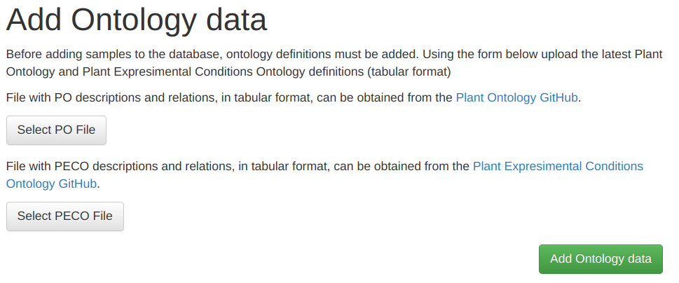

# Adding Ontology definitions

Descriptions for Ontolgy definitions, should be added before
adding functional annotation. This step should be completed first. In
the top menu click on 'Add' and select 'Ontology Data'. 
 

The file with PO descriptions and relations, in tabular format, can be obtained from the Plant Ontology GitHub.
[here](https://github.com/Planteome/plant-ontology).
The file with PECO descriptions are found on Plant Expresimental Conditions Ontology GitHub [here](https://github.com/Planteome/plant-experimental-conditions-ontology). 

Click the buttons on the page and select the corresponding files, next 
click 'Add functional data' to upload the files to your server and 
import them in the database. This process can take some time, do not 
close the browser window. 

**Note: The existing tables will be cleared before adding the new 
definitions. Do not update this information if Ontolgy data is 
already added to species!**